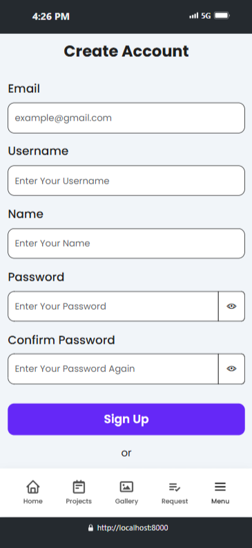
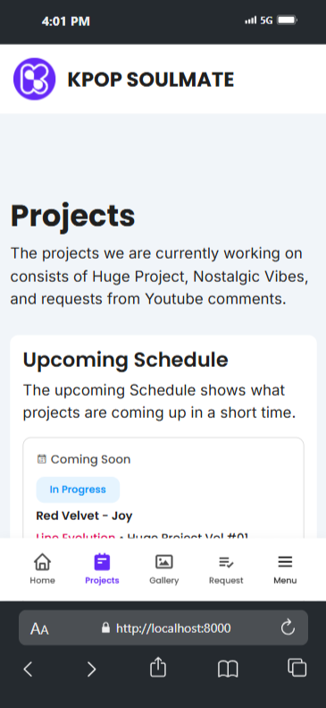
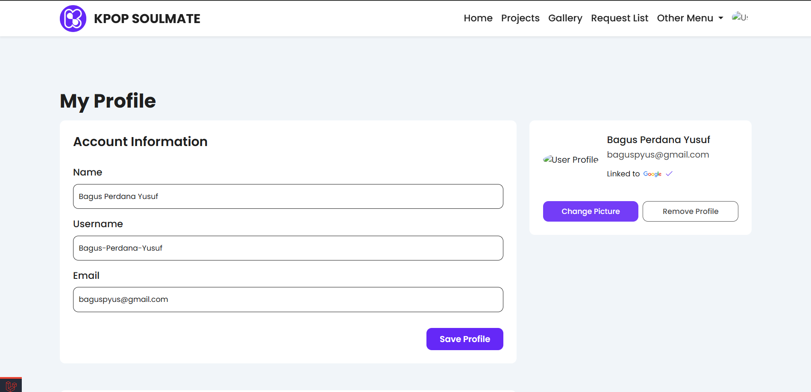
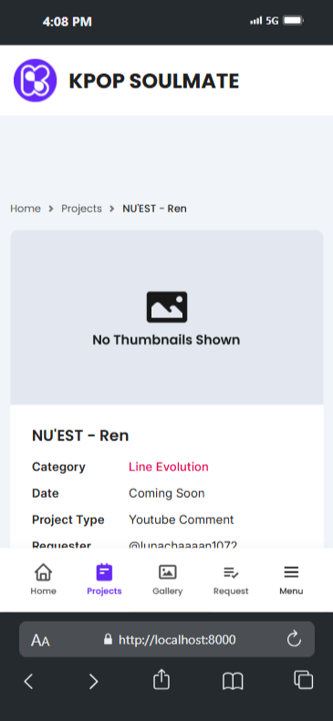
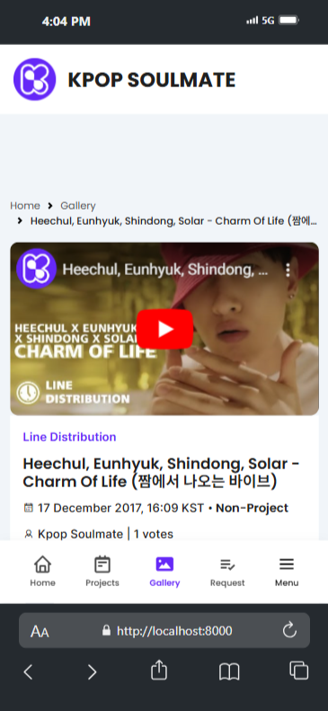

# Content Management Web Application

[**Dokumentasi Bahasa Indonesia (Indonesia Documentation)**](/docs/id/README.md)

**Content Management Web Application** is a web application for managing YouTube content developed using the Laravel framework with the PHP programming language, and MySQL as a relational database. The purpose of this application is to facilitate the creator in managing content, tracking content requests from subscribers, helping subscribers find content created by the creator based on content categories, and sharing AI (Artificial Intelligence) models produced by creators.

## Features

The features contained in this web application are as follows:

-   User and Admin Authentication (creator/owner)
-   Register and Login
-   Dashboard Admin
-   Login with Google Authentication
-   Reset password
-   Profile and Account Management (including upload and edit profile picture)
-   Request Form
-   Create, Read, Update, and Delete (CRUD) in Models
-   Vote content
-   Search and Filter content & request
-   Content upload schedule
-   Request list from subscribers

## Team

-   Bagus Perdana Yusuf (Full-stack Developer, UI & UX Designer)

### Tasks and responsibilities (Bagus)

-   Created mind maps using Whimsical to systematically organize ideas, incorporating detailed planning and specifications.
-   Crafted a user journey map using Figma Jam to outline the steps of user interaction with the product, aiming to identify pain points and enhance the user experience to be more intuitive, efficient, and aligned with the desired goals.
-   Created user flow diagrams using Figma Jam to comprehend user interaction pathways, identify pain points, and enhance design efficiency, resulting in a logical, intuitive, and user-friendly experience.
-   Created a sitemap using Figma Jam to design an intuitive and easy-to-navigate website structure, thereby enhancing user experience and minimizing potential frustration caused by complex navigation.
-   Designed user interfaces (UI) and user experiences (UX) for web and mobile applications using Figma, resulting in responsive, intuitive, and engaging designs.
-   Devised a modular design system encompassing essential elements like color schemes, typography of various sizes, and crucial components to ensure design consistency across products. Designed wireframes, mockups, and prototypes to effectively communicate design concepts.
-   Designed, developed, and maintained a web app using the PHP programming language, the Laravel framework, SASS, the Bootstrap framework, and MySQL Database.
-   Designed efficient database structures and optimized queries to ensure applications run quickly and responsively.
-   Implemented a secure authentication system using the Laravel framework, including login mechanisms (either login with email or login connected to third-party applications like Google), account registration, user session management, account settings and management, and password reset features.
-   Managed good and efficient CRUD (Create, Read, Update, Delete) and filter features for various types of data; it also comes with role-based access control.
-   Conducted debugging and troubleshooting to guarantee the proper functioning of applications and their safety from security vulnerabilities.
-   Deployed the application publicly on web hosting by utilizing Git as a version control system and GitHub as a public code storage platform.

## Preview

These previews are taken from development mode, and not all pages can be shown due to client demand.

### Login Page


### Home


### Register




### Dashboard


### Projects




### Project


### Gallery


### Request


### My Request


### My Profile




### Project Detail




### Video




### Ai Model


## Technology stack & Tools

**This program needs:**

| Tech Stack & Tools                  | Version |
| ----------------------------------- | ------- |
| Alpine Js                           | 3.0+    |
| Bootstrap CSS                       | 5.3.0+  |
| Box Icon                            | 2.1.4+  |
| Chart.js                            | 4.4.1+  |
| Composer                            | 2.20+   |
| Laravel                             | 8.54+   |
| Laragon / XAMP (PHP, MySQL, Apache) | 6.0+    |
| Line Awesome                        | 1.3.0+  |
| Node.js                             | 18.1+   |
| PHP                                 | 8.2.0+  |
| SASS                                | 2.0+    |
| Visual Studio Code                  | Latest  |
| Vite                                | 5.0+    |

## Setup

### Customization `.env`

1. Copy .env-example
2. Rename .env-example copy to .env
3. Modify the`.env`content

### Install Dependencies

Open terminal, type the following commands:

```shell
composer update
npm install
```

### Run Program

Open terminal, type the following commands:

```shell
# generate key
php artisan key:generate
# migrate
php artisan migrate --seed
# run server
php artisan serve
# run server node
npm run dev
```
