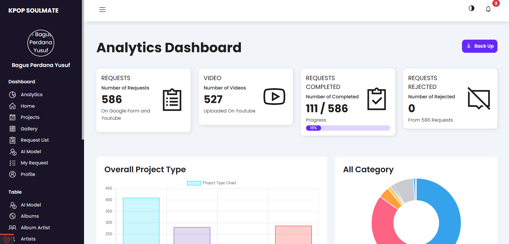
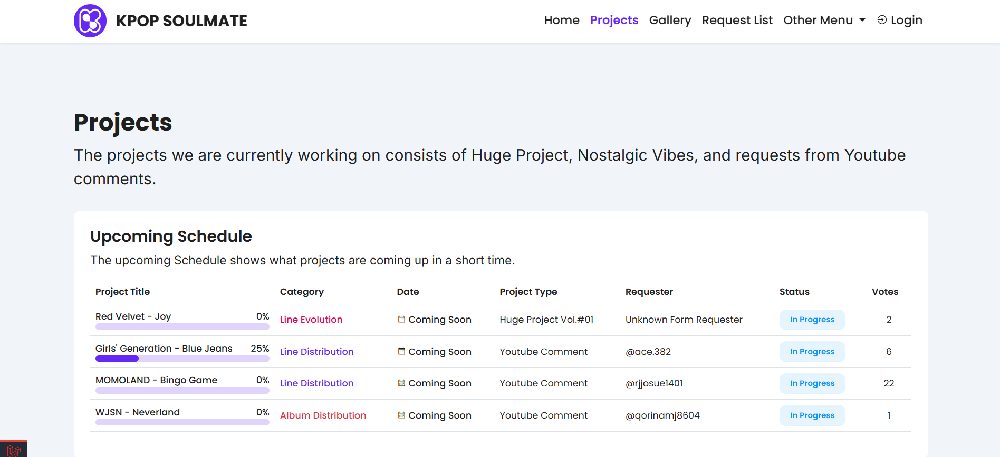
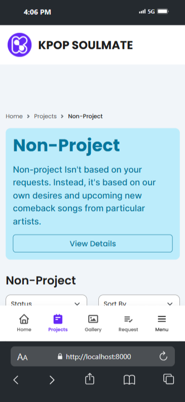
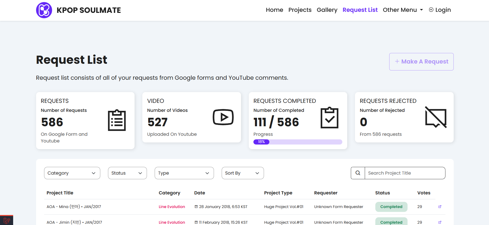

# Content Management Web Application

[**Indonesia Documentation**](/docs/id/README.md)

## About Content Management Web Application

**Content Management Web Application** is a full-stack web application for managing YouTube content developed using the Laravel framework with the PHP programming language, and MySQL database. The purpose of this application is to facilitate the creator to manage content, track content requests from subscribers, help subscribers find content created by creator based on content categories, and share AI models created by creators.

## Features

The features contained in this web application are as follows:

-   User and Admin Authentication (creator/owner)
-   Register and Login
-   Dashboard Admin
-   Login with Google Authentication
-   Reset password
-   Profile and Account Management (including upload and edit profile picture)
-   Request Form
-   Create, Read, Update, and Delete (CRUD) in Models
-   Vote content
-   Search and Filter content & request
-   Content upload schedule
-   Request list from subscribers

## Team

-   Bagus Perdana Yusuf (Full-stack Developer, UI & UX Designer)

### Tasks and responsibilities (Bagus)

-   Designing the User Journey of the app in Figma (Figjam)
-   Designing the User Flow of the app in Figma (Figjam)
-   Make an application sitemap in Figma (Figjam)
-   Create an app Mindmap with Whimsical
-   Designing User Interface and User Experience of app with Figma
-   Design, develop, and maintain web app using PHP programming language, Laravel framework, SASS, Bootstrap framework, and MySQL Database.
-   Design efficient database structures and optimize queries to ensure applications run quickly and responsively
-   Implement a secure authentication system using the Laravel framework, including login mechanisms either login with email or login connected to third-party applications (Google), account registration, user session management, account settings and management, and password reset features.
-   Managing good and efficient CRUD (Create, Read, Update, Delete) and filter features for various types of data, also comes with Role-Based Access Control.
-   Handle debugging and troubleshooting to ensure applications function properly and are safe from security vulnerabilities.
-   Deploy the application publicly on web hosting by utilizing Git as a Version Control System and GitHub as a public code storage platform.

## Preview

These previews are taken from development mode, and not all pages can be shown due to client demand.

### Login Page


### Home


### Register


### Dashboard




### Projects




### Project




### Gallery


### Request




### My Request


### My Profile


### Project Detail


### Video


### Ai Model


## Technology stack & Tools

**This program needs:**

| Tech Stack & Tools                  | Version |
| ----------------------------------- | ------- |
| Alpine Js                           | 3.0+    |
| Bootstrap CSS                       | 5.3.0+  |
| Box Icon                            | 2.1.4+  |
| Chart.js                            | 4.4.1+  |
| Composer                            | 2.20+   |
| Laravel                             | 8.54+   |
| Laragon / XAMP (PHP, MySQL, Apache) | 6.0+    |
| Line Awesome                        | 1.3.0+  |
| Node.js                             | 18.1+   |
| PHP                                 | 8.2.0+  |
| SASS                                | 2.0+    |
| Visual Studio Code                  | Latest  |
| Vite                                | 5.0+    |

## Setup

### Customization `.env`

1. Copy .env-example
2. Rename .env-example copy to .env
3. Modify the`.env`content

### Install Dependencies

Open terminal, type the following commands:

```shell
composer update
npm install
```

### Run Program

Open terminal, type the following commands:

```shell
# generate key
php artisan key:generate
# migrate
php artisan migrate --seed
# run server
php artisan serve
# run server node
npm run dev
```
