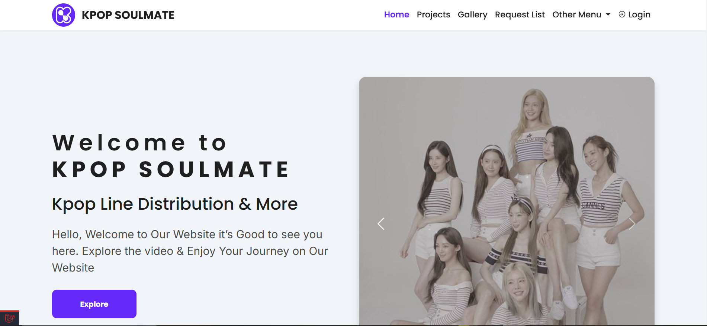

# Aplikasi Web Pengelolaan Konten YouTube

[**English Documentation (Dokumentasi Bahasa Inggris)**](../../README.md)

**Aplikasi Web Pengelolaan Konten** adalah sebuah aplikasi web untuk pengelolaan konten YouTube dikembangkan menggunakan kerangka kerja Laravel dengan bahasa pemrograman PHP, dan MySQL sebagai basis data relasional. Tujuan aplikasi ini adalah untuk memfasilitasi sang kreator untuk mengelola konten, melacak permintaan konten dari pelanggan-pelanggan, membantu pelanggan temukan konten yang dibuat oleh kreator berdasarkan kategori konten, dan membagikan model AI (Artificial Intelligence) yang dibuat kreator.

## Features

Fitur-fitur yang terdapat pada aplikasi web ini adalah sebagai berikut:

-   Autentikasi User dan Admin (kreator/pemilik)
-   Register dan Login
-   Dashboard Admin
-   Otentikasi Login dengan Google
-   Reset password
-   Profile and Account Management (termasuk unggah dan ubah gambar profil)
-   Request Form
-   Create, Read, Update, and Delete (CRUD) pada Model
-   Vote konten
-   Pencarian dan Penyaringan konten & permintaan
-   Jadwal upload konten
-   Daftar permintaan dari Subscriber

## Team

-   Bagus Perdana Yusuf (Full-stack Developer, UI & UX Designer)

### Tasks and responsibilities (Bagus)

-   Membuat mind map menggunakan Whimsical untuk mengorganisasikan gagasan secara terstruktur dengan perencanaan dan spesifikasi secara terperinci.
-   Menyusun peta perjalanan pengguna menggunakan Figma Jam untuk memetakan langkah-langkah interaksi pengguna dengan produk, guna mengidentifikasi pain points dan meningkatkan pengalaman pengguna yang lebih baik, intuitif, dan efisien sehingga mencapai tujuan yang diinginkan.
-   Membuat alur pengguna dengan Figma Jam untuk memahami jalur interaksi yang dilalui pengguna, mengidentifikasi titik masalah, serta mengoptimalkan efisiensi desain guna menciptakan pengalaman pengguna yang logis, intuitif, dan mudah dipahami.
-   Membuat peta situs dengan Figma Jam untuk merancang struktur situs web yang intuitif dan mudah dinavigasi, sehingga meningkatkan pengalaman pengguna dan mengurangi potensi frustrasi akibat navigasi yang rumit.
-   Mendesain antarmuka pengguna (UI) dan pengalaman pengguna (UX) untuk aplikasi web dan mobile dengan memanfaatkan Figma guna menciptakan desain yang responsif, intuitif, dan menarik.
-   Merancang sistem desain modular yang mencakup elemen penting seperti skema warna, tipografi dengan ukuran yang bervariasi, dan komponen yang diperlukan guna menciptakan konsistensi desain di seluruh produk. Mendesain kerangka kerja desain, malet, dan purwarupa untuk mengomunikasikan konsep desain secara jelas dan efektif.
-   Merancang, mengembangkan dan memelihara aplikasi web menggunakan bahasa pemrograman PHP, kerangka kerja Laravel, SASS, kerangka kerja Bootstrap, dan basis data MySQL.
-   Mendesain struktur basis data yang efisien dan mengoptimalkan query untuk memastikan aplikasi berjalan dengan cepat dan responsif
-   Mengimplementasikan sistem autentikasi yang aman menggunakan framework Laravel, termasuk mekanisme login baik login dengan email maupun login yang terhubung dengan aplikasi pihak ketiga (Google), pendaftaran akun, pengelolaan sesi pengguna, pengaturan dan pengelolaan akun, serta fitur setel ulang kata sandi.
-   Mengolah fitur CRUD (Create, Read, Update, Delete) dan filter yang baik dan efisien untuk berbagai jenis data, juga dilengkapi dengan kontrol akses berbasis peran (Role Based Access Control).
-   Menangani debugging dan pemecahan masalah untuk memastikan aplikasi berfungsi dengan baik dan bebas dari kerentanan keamanan.
-   Menyebarkan (deploy) aplikasi secara publik pada web hosting dengan memanfaatkan Git sebagai Version Control System dan GitHub sebagai wadah penyimpanan kode secara publik.

## Preview

Preview ini di ambil dari mode development, dan tidak semua halaman dapat diperlihatkan karena permintaan klien.

### Login Page


### Home




### Register


### Dashboard


### Projects


### Project


### Gallery


### Request


### My Request


### My Profile


### Project Detail


### Video


### Ai Model


## Technology stack & Tools

**Program ini membutuhkan:**

| Tech Stack & Tools                  | Version |
| ----------------------------------- | ------- |
| Alpine Js                           | 3.0+    |
| Bootstrap CSS                       | 5.3.0+  |
| Box Icon                            | 2.1.4+  |
| Chart.js                            | 4.4.1+  |
| Composer                            | 2.20+   |
| Laravel                             | 8.54+   |
| Laragon / XAMP (PHP, MySQL, Apache) | 6.0+    |
| Line Awesome                        | 1.3.0+  |
| Node.js                             | 18.1+   |
| PHP                                 | 8.2.0+  |
| SASS                                | 2.0+    |
| Visual Studio Code                  | Latest  |
| Vite                                | 5.0+    |

## Setup

### Kustomisasi `.env`

1. Copy .env-example
2. Rename .env-example copy menjadi .env
3. Ubah isi `.env`nya

### Install Dependencies

Buka terminal, ketikkan perintah:

```shell
composer update
npm install
```

### Run Program

Buka terminal, ketikkan perintah:

```shell
# generate key
php artisan key:generate
# migrate
php artisan migrate --seed
# run server
php artisan serve
# run server node
npm run dev
```
