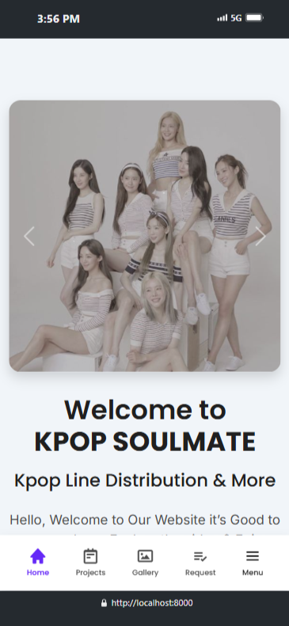

# Aplikasi Web Pengelolaan Konten YouTube

[**Dokumentasi English**](../../README.md)

## About Aplikasi Web Pengelolaan Konten YouTube

**Aplikasi Web Pengelolaan Konten YouTube** adalah aplikasi web full-stack untuk pengelolaan konten YouTube di bangun menggunakan framework Laravel dengan bahasa pemrograman PHP, dan database MySQL. Tujuan pembangunan aplikasi ini agar memudahkan sang kreator mengelola konten, melacak permintaan konten dari subscriber, memudahkan subscriber dalam mencari konten yang dibuat kreator berdasarkan kategori konten, dan membagikan model AI yang dibuat oleh kreator.

## Features

Fitur-fitur yang terdapat pada aplikasi web ini adalah sebagai berikut:

-   Autentikasi User dan Admin (kreator/pemilik)
-   Register dan Login
-   Dashboard Admin
-   Otentikasi Login dengan Google
-   Reset password
-   Profile and Account Management (termasuk unggah dan ubah gambar profil)
-   Request Form
-   Create, Read, Update, and Delete (CRUD) pada Model
-   Vote konten
-   Pencarian dan Penyaringan konten & permintaan
-   Jadwal upload konten
-   Daftar permintaan dari Subscriber

## Team

-   Bagus Perdana Yusuf (Full-stack Developer, UI & UX Designer)

### Tasks and responsibilities (Bagus)

-   Mendesain User Journey (Perjalanan Pengguna) aplikasi di Figma (Figjam)
-   Mendesain User Flow (Alur pengguna) aplikasi di Figma (Figjam)
-   Membuat Sitemap aplikasi di Figma (Figjam)
-   Membuat Mindmap aplikasi dengan Whimsical
-   Mendesain User Interface dan User Experience aplikasi dengan Figma
-   Merancang, mengembangkan, dan memelihara aplikasi web menggunakan bahasa pemrograman PHP, framework Laravel, SASS, framework Bootstrap, dan MySQL Database.
-   Mendesain struktur basis data yang efisien dan mengoptimalkan query untuk memastikan aplikasi berjalan dengan cepat dan responsif
-   Mengimplementasikan sistem autentikasi yang aman menggunakan framework Laravel, termasuk mekanisme login baik login dengan email maupun login yang terhubung dengan aplikasi pihak ketiga (Google), pendaftaran akun, pengelolaan sesi pengguna, pengaturan dan pengelolaan akun, serta fitur reset password.
-   Mengolah fitur CRUD (Create, Read, Update, Delete) dan filter yang baik dan efisien untuk berbagai jenis data, juga dilengkapi dengan kontrol akses berbasis peran (Role-Based Access Control).
-   Menangani debugging dan pemecahan masalah untuk memastikan aplikasi berfungsi dengan baik dan bebas dari kerentanan keamanan.
-   Menyebarkan (deploy) aplikasi secara publik pada web hosting dengan memanfaatkan Git sebagai Version Control System dan GitHub sebagai wadah penyimpanan kode secara publik.

## Preview

Preview ini di ambil dari mode development, dan tidak semua halaman dapat diperlihatkan karena permintaan klien.

### Login Page


### Home




### Register


### Dashboard


### Projects


### Project


### Gallery


### Request


### My Request


### My Profile


### Project Detail


### Video


### Ai Model


## Technology stack & Tools

**Program ini membutuhkan:**

| Tech Stack & Tools                  | Version |
| ----------------------------------- | ------- |
| Alpine Js                           | 3.0+    |
| Bootstrap CSS                       | 5.3.0+  |
| Box Icon                            | 2.1.4+  |
| Chart.js                            | 4.4.1+  |
| Composer                            | 2.20+   |
| Laravel                             | 8.54+   |
| Laragon / XAMP (PHP, MySQL, Apache) | 6.0+    |
| Line Awesome                        | 1.3.0+  |
| Node.js                             | 18.1+   |
| PHP                                 | 8.2.0+  |
| SASS                                | 2.0+    |
| Visual Studio Code                  | Latest  |
| Vite                                | 5.0+    |

## Setup

### Kustomisasi `.env`

1. Copy .env-example
2. Rename .env-example copy menjadi .env
3. Ubah isi `.env`nya

### Install Dependencies

Buka terminal, ketikkan perintah:

```shell
composer update
npm install
```

### Run Program

Buka terminal, ketikkan perintah:

```shell
# generate key
php artisan key:generate
# migrate
php artisan migrate --seed
# run server
php artisan serve
# run server node
npm run dev
```
